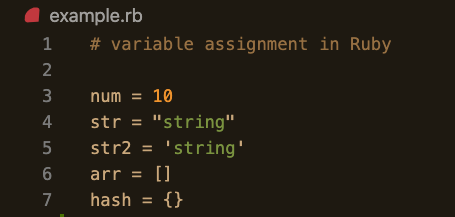
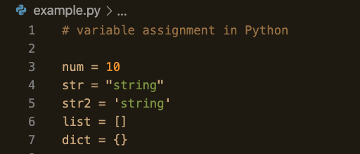
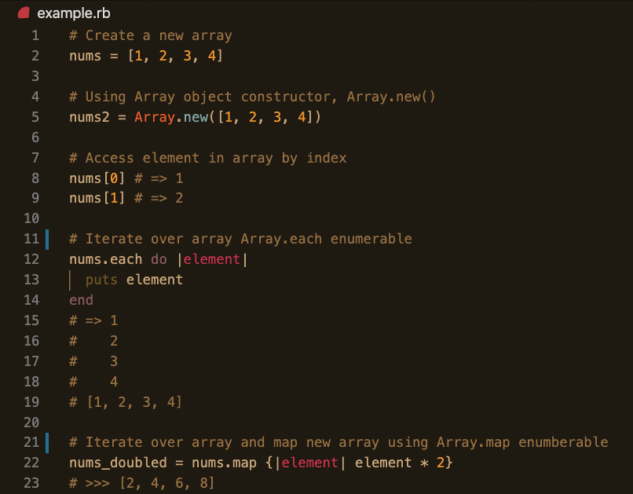
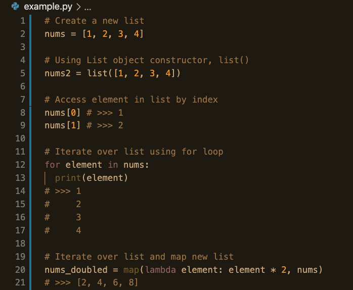

### What is Python? 

Like Ruby, Python is a high-level, object-oriented scripting language. Unlike Ruby, though, Python is a general-purpose programming language that equips a programmer with the tools to tackle fields like machine learning (ML) and artificial intelligence (AI), data analytics, data visualization, finTech, cloud storage, gaming, and so much more. While Ruby is more renowned for it's english-like syntax and overall elegance, Python is no slacker when it comes to readability and ease-of-use. It's so easy to use that the learning curve for Python is pretty minimal&mdash;so much so that many universities have switched out beloved Java for Python as the first language taught to students. 

Python is easy and _intuitive_ to use, allowing for faster development. Also, a big tenet of Python is that code should be explicit. Ruby leverages a lot of behind-the-scenes magic that lends flexibility and creativity to Rubyists, whereas Pythonistas typically believe there is **one** _explicit_ and most efficient solution. The expliciteness of Python also promotes easier debugging and understanding of code since everything that is happening is explicity coded in your file. 

In addition, the Python community is robust and buzzing. It's popularity has increased steadily. As a consequence, Python has a vast library of pre-built code that you can use in your own code, called packages, making Python hugely extensible. (Yes, Ruby also has pre-built code available to programmers called gems, but the library of gems isn't nearly as vast as the library Python packages.)

With this introductory knowledge, let's get into some basics of actually writing Python and how it compares to Ruby. 

### Variables 

Variables, variable assignment, and variable _re_-assignment in Ruby and Python are virtually identical. In both languages, variables are dynamically typed and reference objects. 

Ruby:    
{:class="img-responsive"}  

Python:    
{:class="img-responsive"}  

Congrats! As a practicing Rubyist, you've already gained a solid grasp of variables in Python!

### Arrays ==> Lists

In Ruby, we have arrays&mdash;a data structure used to hold data of different types and assign an index to each one. Python's equivalent is called a List. Functionally, a list is the same as a Ruby array. 

List definition: 
>A list is a data structure in Python that is a mutable, or changeable, ordered sequence of elements.
Source: [Understanding Lists in Python 3](https://www.digitalocean.com/community/tutorials/understanding-lists-in-python-3#:~:text=versions%20279.6k-,Introduction,values%20between%20square%20brackets%20%5B%20%5D%20.)

Ruby:  
{:class="img-responsive"}  

Python:  
{:class="img-responsive"}  

As you can see, lists and arrays are very similar. The syntax for creating a new list and array are identical when using the array/list literals. One huge differnce is how we iterate over a list in Python versus iterating over an array in Ruby. Ruby provides enumerables that make iteration super easy (Ruby is super flexible and magical) so that you never really have to use a for loop to iterate in Ruby. In Python, though, there are no enumberable methods that can be called _on_ a list. While there are _functions_ such as map() that can be passed a list as an argument, if you want to simply do some work on a list such as printing out each element, the preferred, most efficient, and explicit way to achive this is through a **for** loop. Taking a close look, you can see that the syntax in a for loop iterating over a list is pretty similar to that of the enumerables in Ruby in block form.  

### Hash ==> Dictionary

