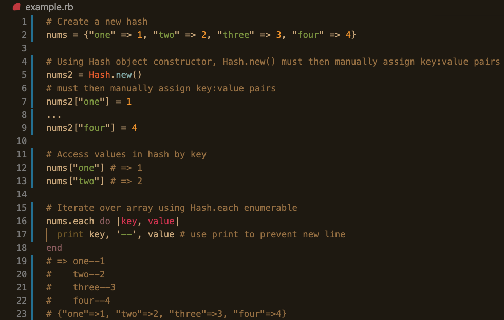
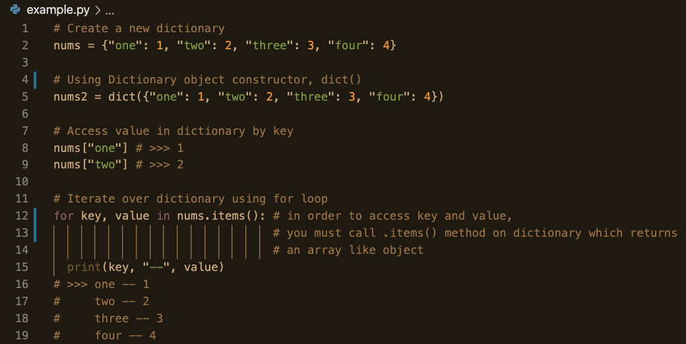

### What is Python? 

Like Ruby, Python is a high-level, object-oriented scripting language. Unlike Ruby, though, Python is a general-purpose programming language that equips a programmer with the tools to tackle fields like machine learning (ML) and artificial intelligence (AI), data analytics, data visualization, finTech, cloud storage, gaming, and so much more. While Ruby is more renowned for it's english-like syntax and overall elegance, Python is no slacker when it comes to readability and ease-of-use. It's so easy to use that the learning curve for Python is pretty minimal&mdash;so much so that many universities have switched out beloved Java for Python as the first language taught to students. 

Python is easy and _intuitive_ to use, allowing for faster development. Also, a big tenet of Python is that code should be explicit. Ruby leverages a lot of behind-the-scenes magic that lends flexibility and creativity to Rubyists, whereas Pythonistas typically believe there is **one** _explicit_ and most efficient solution. The expliciteness of Python also promotes easier debugging and understanding of code since everything that is happening is explicity coded in your file. 

In addition, the Python community is robust and buzzing. It's popularity has increased steadily. As a consequence, Python has a vast library of pre-built code that you can use in your own code, called packages, making Python hugely extensible. (Yes, Ruby also has pre-built code available to programmers called gems, but the library of gems isn't nearly as vast as the library Python packages.)

With this introductory knowledge, let's get into some basics of actually writing Python and how it compares to Ruby. 

### Variables 

Variables, variable assignment, and variable _re_-assignment in Ruby and Python are virtually identical. In both languages, variables are dynamically typed and reference objects. 

Ruby:    
{:class="img-responsive"}  

Python:    
{:class="img-responsive"}  

Congrats! As a practicing Rubyist, you've already gained a solid grasp of variables in Python!

### Arrays ==> Lists

In Ruby, we have arrays&mdash;a data structure used to hold data of different types and assign an index to each one. Python's equivalent is called a List. Functionally, a list is the same as a Ruby array. 

List definition:  
>A list is a data structure in Python that is a mutable, or changeable, ordered sequence of elements.  
Source: [Understanding Lists in Python 3](https://www.digitalocean.com/community/tutorials/understanding-lists-in-python-3#:~:text=versions%20279.6k-,Introduction,values%20between%20square%20brackets%20%5B%20%5D%20.)

Ruby:  
{:class="img-responsive"}  

Python:  
{:class="img-responsive"}  

As you can see, lists and arrays are very similar. The syntax for creating a new list and array are identical when using the array/list literals. One huge differnce is how we iterate over a list in Python versus iterating over an array in Ruby. Ruby provides enumerables that make iteration super easy (Ruby is super flexible and magical) so that you never really have to use a for loop to iterate in Ruby. In Python, though, there are no enumberable methods that can be called _on_ a list. While there are _functions_ such as map() that can be passed a list as an argument, if you want to simply do some work on a list such as printing out each element, the preferred, most efficient, and explicit way to achive this is through a **for** loop. Taking a close look, you can see that the syntax in a for loop iterating over a list is pretty similar to that of the enumerables in Ruby in block form.  

Python also has built-in [List Methods](https://docs.python.org/3/tutorial/datastructures.html) for list manipulation, such as adding to list, deleting from, and even sorting a list.

### Hash ==> Dictionary

A Hash in Ruby is a data structure composed of key and value pairs. And, you guessed it, Python has it's own similar data structure. A Dictionary! Just as in Ruby, a Python dictionary is an unordered collection of key-value pairs. Dictionary is a much better and descriptive name for such a structure. A real dictionary is exactly the same as a Python dictionary. You search the dictionary by word&mdash;key&mdash;and it returns to you the definition&mdash;value&mdash;of that word.  

Dictionary definition:  
>Dictionaries are Python’s implementation of a data structure that is more generally known as an associative array. A dictionary consists of a collection of key-value pairs. Each key-value pair maps the key to its associated value.  
Source: [Dictionaries in Python](https://realpython.com/python-dicts/)

Ruby:  
{:class="img-responsive"}

Python:  
{:class="img-responsive"}

Creating a new dictionary instance is very similar to creating a new hash instance in Ruby, aside from small syntactical differences. In Ruby, if you want to use a string as a key, you must use the arrow syntax **"key" => value**. Using **"key":value** would convert the string into a Ruby symbol. Python does not support use of symbols, and there are only 2 syntactical ways to add a key-value pair to a dictionary. 

```python 
new_dictionary = {"one": 1}
new_dictionary 
>>> {'one': 1}
``` 
Or, if the dictionary has already been declared, you can assign new key-value pairs using square brackets and the assignment operator, "=".
```python
newer_dictionary = {}
newer_dictionary["one"] = 1
newer_dictionary 
>>> {'one': 1}
```
Additionally, there are built-in [Dictionary Methods](https://realpython.com/python-dicts/#built-in-dictionary-methods) for manipulating dictionaries. 

### Conclusion

Python is a powerful, high-level language. It's an immensely popular language in today's tech landscape. Look at any job board or just google "developer jobs", and without a doubt, you will come across multiple listings seeking to hire devs with Python in their armory. So if you want to be more marketable and a more lethal coder, learning Python is a no brainer. 

#### Resources

[Ruby vs. Python: What’s the Difference?](https://learn.onemonth.com/ruby-vs-python/)  
[Python Docs](https://docs.python.org/3/)  
[Real Python](https://realpython.com/)   
[What Is Python Used for?](https://www.stxnext.com/what-is-python-used-for/?_gl=1*nzhwpn*_ga*NDMxMTY4MzYyLjE2MDY2ODc5MjI.*_ga_R2CH941DXR*MTYwNjY4NzkyMS4xLjAuMTYwNjY4NzkyMS42MA..#internet-of-things)  
[What is Python?](https://pythoninstitute.org/what-is-python/)  
[Programming language Python's popularity](https://www.zdnet.com/article/programming-language-pythons-popularity-ahead-of-java-for-first-time-but-still-trailing-c/#:~:text=Python%20shows%20a%202.27%25%20rise,JavaScript%20as%20the%20top%20language.)  
[Variables in Python](https://realpython.com/python-variables/)  
[Understanding Lists in Python 3](https://www.digitalocean.com/community/tutorials/understanding-lists-in-python-3#:~:text=versions%20279.6k-,Introduction,values%20between%20square%20brackets%20%5B%20%5D%20.)  
[Dictionaries in Python](https://realpython.com/python-dicts/)  


